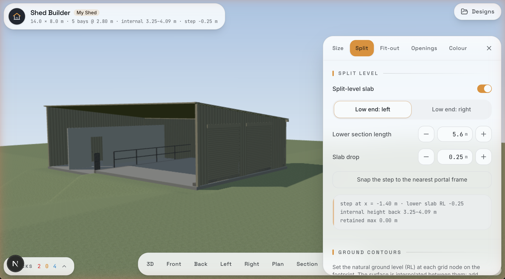
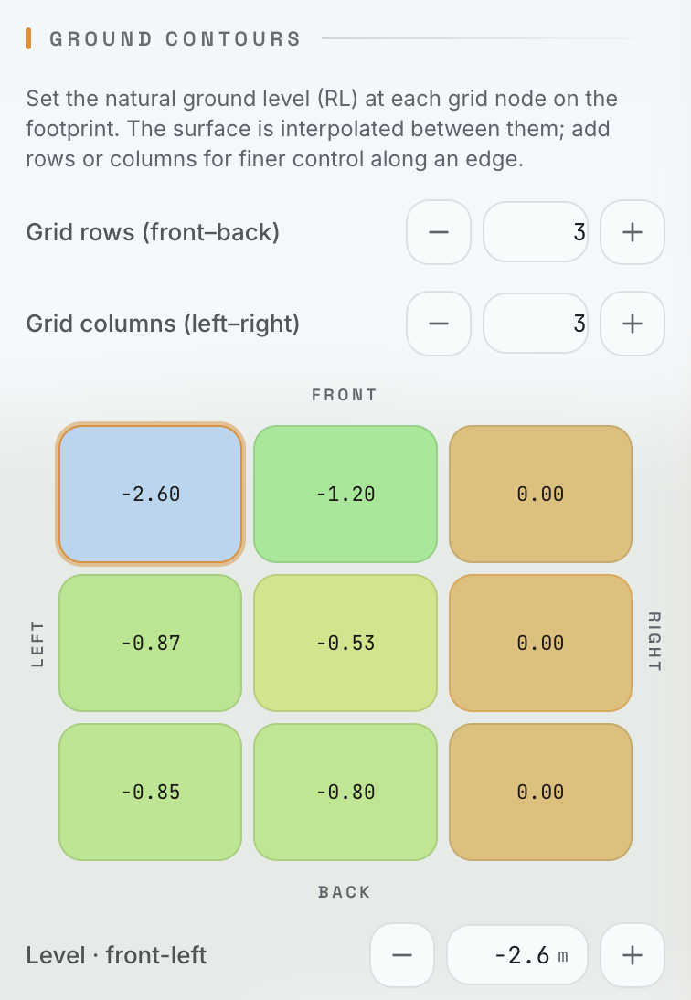
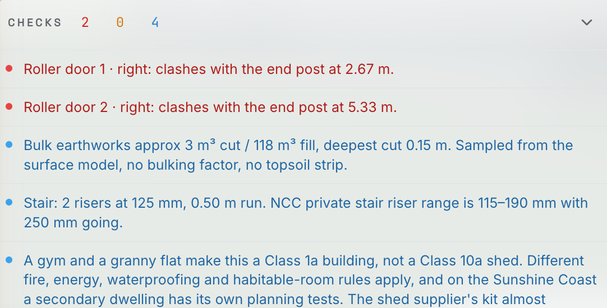

# Shed Builder

> A split-level shed configurator with a live 3D model — design the building, the site, and the earthworks together, and get real-time buildability checks as you go.

Shed Builder turns a set of dimensions into a walkable 3D shed: pick the span, length, roof and bays; split the slab and cut it into a slope; shape the ground with an editable contour grid; fit out the lower level; and place doors and windows — all while a validation engine flags clashes and code issues **with one-tap fixes**. It's touch-first for use on an iPad in the field, and runs entirely in the browser with no backend.

Built with **Next.js 16 (App Router) · React 19 · TypeScript · Tailwind v4 · shadcn/ui** and **Three.js** for the real-time WebGL viewport.

---

## Screenshots

### The configurator

A parametric split-level shed on contoured ground, with the live 3D model and the control panel side by side. Orbit, pan and pinch on touch; switch views, split the slab, and read internal heights and the step level as you go.



### Ground contours

Set the natural ground level (RL) at each node of an editable grid pinned to the footprint — height-tinted for readability and interpolated between points, so the land can fall toward any corner, not just end-to-end. Add rows or columns for finer control along an edge.



### Live checks

A validation engine surfaces clashes, code issues and earthworks notes as you design — bay and end-post clashes, headroom, NCC ceiling and stair rules, retained-height and Class 1a warnings — each with a one-tap fix.



---

## What it does

| Area | Capabilities |
| :--- | :--- |
| **Building** | Parametric span / length / wall height / pitch · gable or skillion roof (falls toward any wall) · portal-frame bays · eave & gable overhangs |
| **Split level** | Split slab with a step, riser and retaining nib · snap the step to a portal frame · internal-height and retained-height readouts |
| **Ground contours** | Editable **grid of spot levels (RL)** pinned to the footprint, bilinearly interpolated — model a fall toward any corner, not just end-to-end · adjustable grid resolution · benched pad with cut/fill batters and a bulk-earthworks estimate |
| **Fit-out** | Lower-level gym / granny flat / bathroom / stair with NCC-aware ceiling, stair and area checks |
| **Openings** | Roller doors, PA doors and windows with live bay-clash, headroom, corner and below-ground validation |
| **Finish** | Per-element Colorbond-range colour picker (screen approximations) |
| **Checks** | A validation engine surfacing errors / warnings / notes, each with a one-tap fix, plus "fix all" that re-validates until stable |
| **Viewport** | Touch-first orbit / two-finger pan / pinch-zoom · view presets (3D, elevations, plan, section) · PNG screenshot · JSON export |
| **Designs** | Autosave plus named save / load / delete in the browser (localStorage), with JSON import/export |

### The 3D engine

The geometry, validation and Three.js scene builder in [`lib/shed/`](lib/shed) were ported **verbatim** from an original single-file prototype — see [`reference/`](reference). Types were added and deprecated Three.js APIs updated; the numeric model is unchanged, and the prototype remains the parity reference.

---

## Getting started

Requires Node.js 20+.

```bash
npm install
npm run dev
```

Open [http://localhost:3000](http://localhost:3000).

```bash
npm run build   # production build
npm run lint    # eslint
npx tsc --noEmit  # type-check
```

---

## Deploy to AWS Amplify

The app is a standard Next.js SSR app (App Router). Amplify Hosting auto-detects Next.js and provisions its managed compute runtime.

1. Push this repo to GitHub.
2. In the Amplify console, **Host a web app** → connect the repository and branch.
3. Amplify detects Next.js and uses the build spec in [`amplify.yml`](amplify.yml) (`.next` output, managed SSR). No environment variables are required — the app has no server-side secrets.
4. Deploy.

> Currently every route is client-rendered, so there's no server-side logic yet — SSR compute is used to keep the door open for future server features. A static export (`output: 'export'`) would also work if you prefer static hosting.

---

## Project structure

```
app/                     # Next.js App Router entry (single client page) + layout, icon, globals
components/
  configurator/          # ConfiguratorShell, Viewport (Three.js), TopBar, ControlPanel,
                         # ChecksBar, ViewToolbar, control atoms, and per-tab panels/
  ui/                    # shadcn/ui components
lib/shed/                # the engine: constants, geometry, validation, scene, storage
hooks/                   # useShedConfig (state + persistence), useValidation
types/                   # ShedConfig and related domain types
reference/               # the original prototype (parity reference, not built)
```

---

## Disclaimers

**Not a substitute for engineering or certification.** Shed Builder is a design and
visualisation tool. Its buildability, earthworks and code-related checks are
indicative only and must be verified by a licensed engineer and building certifier
before construction.

**Colorbond®** is a registered trademark of BlueScope Steel Limited. Colours shown
are approximate on-screen representations for visualisation only — they are not
colour-matched, and this project is not affiliated with or endorsed by BlueScope.

---

## License

[Apache-2.0](LICENSE) © 2026 Rob Costello
